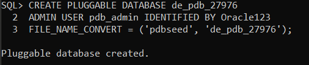
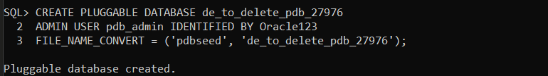

# Oracle Database Assignment II: PDB Creation, Deletion & OEM

**Student Name:** Uwamwezi Denyse 
**Student ID:** 27976  
**Submission Date:** October 5, 2025  

---

## 📋 Executive Summary

This report documents the completion of Assignment II, which involved creating and managing Pluggable Databases (PDBs) in Oracle Database 21c Express Edition, and configuring Oracle Enterprise Manager. All three tasks were successfully completed: creating a permanent PDB, creating and deleting a temporary PDB, and accessing the Oracle Enterprise Manager dashboard.

---

## 🎯 Task 1: Create a New Pluggable Database

### Objective
Create a PDB named `de_pdb_27976` with a dedicated user account.

### Steps Performed

1. **Connected to Oracle as SYSDBA:**
   ```sql
   sqlplus / as sysdba
   ```

2. **Created the PDB:**
   ```sql
   CREATE PLUGGABLE DATABASE de_pdb_27976
   ADMIN USER pdb_admin IDENTIFIED BY Oracle123
   FILE_NAME_CONVERT = ('pdbseed', 'de_pdb_27976');
   ```

3. **Opened the PDB:**
   ```sql
   ALTER PLUGGABLE DATABASE de_pdb_27976 OPEN;
   ```

4. **Configured auto-start:**
   ```sql
   ALTER PLUGGABLE DATABASE de_pdb_27976 SAVE STATE;
   ```

5. **Created user account:**
   ```sql
   ALTER SESSION SET CONTAINER = de_pdb_27976;
   CREATE USER denyse_plsqlauca_27976 IDENTIFIED BY [password];
   GRANT CONNECT, RESOURCE, DBA TO denyse_plsqlauca_27976;
   ```

### Verification
Verified PDB creation using:
```sql
SELECT name, open_mode FROM v$pdbs;
```

### Screenshots

| Task | Screenshot |
|------|------------|
| PDB Creation |  |
| User Creation |  |
| Verification |  |

### Result
 **Successfully created PDB `de_pdb_27976` with user `denyse_plsqlauca_27976`**

---

## 🔄 Task 2: Create and Delete a PDB

### Objective
Create a temporary PDB and then delete it, documenting both creation and deletion.

### Steps Performed

#### Creating the Temporary PDB

1. **Switched to CDB root:**
   ```sql
   ALTER SESSION SET CONTAINER = CDB$ROOT;
   ```

2. **Created temporary PDB:**
   ```sql
   CREATE PLUGGABLE DATABASE de_to_delete_pdb_27976
   ADMIN USER pdb_admin IDENTIFIED BY Oracle123
   FILE_NAME_CONVERT = ('pdbseed', 'de_to_delete_pdb_27976');
   ```

3. **Opened the PDB:**
   ```sql
   ALTER PLUGGABLE DATABASE de_to_delete_pdb_27976 OPEN;
   ```

4. **Verified both PDBs exist:**
   ```sql
   SELECT name, open_mode FROM v$pdbs;
   ```

#### Deleting the Temporary PDB

5. **Closed the PDB before deletion:**
   ```sql
   ALTER PLUGGABLE DATABASE de_to_delete_pdb_27976 CLOSE IMMEDIATE;
   ```

6. **Deleted the PDB:**
   ```sql
   DROP PLUGGABLE DATABASE de_to_delete_pdb_27976 INCLUDING DATAFILES;
   ```

7. **Verified deletion:**
   ```sql
   SELECT name, open_mode FROM v$pdbs;
   ```

### Screenshots

| Stage | Screenshot | Description |
|-------|------------|-------------|
| Creation |  | Creating the temporary PDB |
| Verification |  | Both PDBs existing together |
| Deletion |  | PDB deletion and verification |

### Result
**Successfully created and deleted `de_to_delete_pdb_27976`**  
**Permanent PDB `de_pdb_27976` remains intact**

---

## 🖥️ Task 3: Oracle Enterprise Manager Configuration

### Objective
Configure and access Oracle Enterprise Manager to view the database and PDBs.

### Steps Performed

1. **Checked EM Express port configuration:**
   ```sql
   SELECT DBMS_XDB_CONFIG.GETHTTPSPORT() FROM DUAL;
   ```

2. **Enabled HTTPS port (if needed):**
   ```sql
   EXEC DBMS_XDB_CONFIG.SETHTTPSPORT(5500);
   ```

3. **Accessed EM Express:**
   - **URL:** `https://localhost:5500/em`
   - **Username:** `sys`
   - **Container:** `CDB$ROOT`
   - **Role:** `SYSDBA`

4. **Navigated to Database Home dashboard**

### Screenshot


*OEM Dashboard showing username 'sys' and de_pdb_27976 in Resources*

### Observations
- Successfully accessed Oracle Enterprise Manager Express (EM Express)
- Dashboard clearly shows database status and resource utilization
- PDB `de_pdb_27976` is visible in the Resources section
- Database shows healthy status with multiple PDBs (PDB$SEED, XEPDB1 pre-existing, plus de_pdb_27976)

## Issues Encountered and Solutions

### Issue 1: Incomplete Oracle Installation
**Problem:** Initial Oracle installation had empty bin folder with no `sqlplus.exe`

**Solution:** 
- Removed incomplete installation using `sc delete` commands
- Cleaned up registry and file system
- Performed fresh installation of Oracle 21c XE as Administrator
- Verified all services started properly

### Issue 2: SQL*Plus Not Recognized
**Problem:** `sqlplus` command not found in PATH

**Solution:**
- Set environment variables:
  ```powershell
  $env:ORACLE_HOME = "C:\app\Dell\product\21c\dbhomeXE"
  $env:PATH = "$env:ORACLE_HOME\bin;$env:PATH"
  ```
- Set ORACLE_SID for proper connection:
  ```powershell
  $env:ORACLE_SID = "XE"
  ```

### Issue 3: Login Authentication
**Problem:** Initial connection attempts failed with ORA-01017

**Solution:**
- Used Windows authentication: `sqlplus / as sysdba`
- Set ORACLE_SID environment variable before connecting
- This bypassed password issues and connected successfully

### Issue 4: Administrative Privileges
**Problem:** Installer showed "User must be in Administrators group" error

**Solution:**
- Right-clicked installer and selected "Run as administrator"
- This bypassed the privilege check and allowed installation to proceed

---

##  Repository Structure

```
denyse_uwamwezi_pdb/
├── README.md                    # This comprehensive report
└── Screenshots/                 # Assignment evidence
    ├── Task1-CreatePDB.png     # PDB creation process
    ├── Task1-CreateUser.png    # User creation process  
    ├── Task1-VerifyCreation.png # Verification of PDB creation
    ├── Task2-CreateAnotherPDB.png # Temporary PDB creation
    ├── Task2-VerifyPDBCreated.png # Both PDBs verification
    ├── Task2-PDBdeletion.png   # PDB deletion process
    └── Task3-OEMdashboard.png  # OEM Dashboard access
```

---
